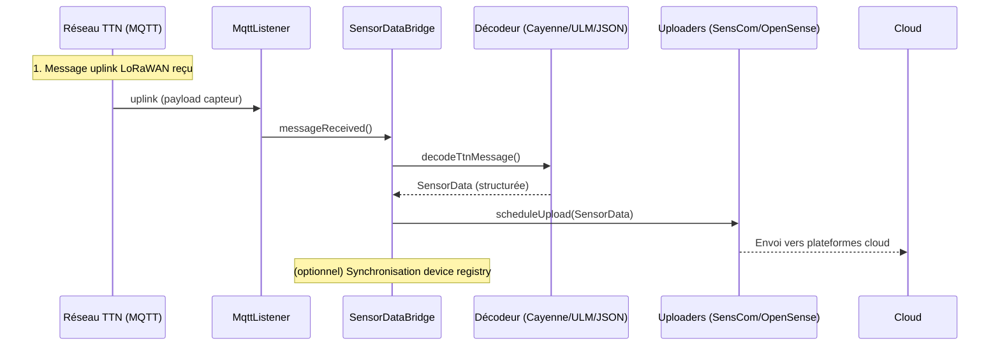
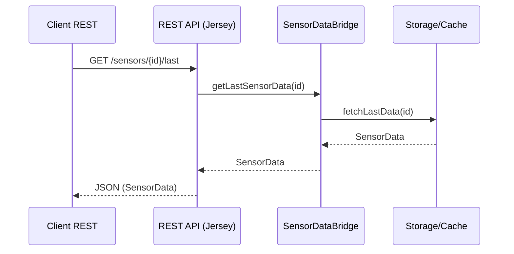
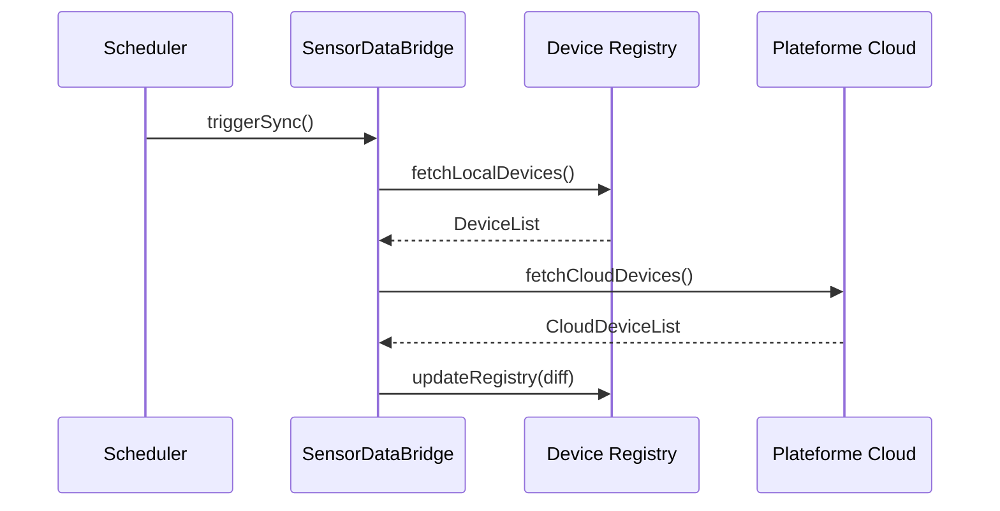

# Architecture technique – sensor-data-bridge

## 1. Vue d’ensemble

Le module `sensor-data-bridge` est le cœur de l’application. Il fait l’interface entre différents réseaux IoT (LoRa, TTN, Helium, NB-IoT), effectue le décodage des messages capteurs reçus, gère les interactions avec les plateformes Cloud (OpenSense, SensCom, etc.), expose des APIs REST d’intégration (Jersey) et communique des données via MQTT.

### Schéma d’architecture globale

```mermaid
graph TD
    subgraph Réseaux_IoT
        TTN[TTN]
        Helium[Helium]
        NBIoT[NB-IoT]
    end
    subgraph Bridge
        MqttListener[MqttListener]
        SensorDataBridge[SensorDataBridge]
        Decoder[Decoder (Cayenne/ULM/JSON)]
        Uploaders[Uploaders (SensCom/OpenSense)]
        RestAPI[REST API (Jersey)]
    end
    subgraph Plateformes_Cloud
        SensCom[SensCom]
        OpenSense[OpenSense]
    end
    TTN --> MqttListener
    Helium --> MqttListener
    NBIoT --> MqttListener
    MqttListener --> SensorDataBridge
    SensorDataBridge --> Decoder
    SensorDataBridge --> Uploaders
    SensorDataBridge --> RestAPI
    Uploaders --> SensCom
    Uploaders --> OpenSense
```

## 2. Composants principaux

- **MqttListener** : Écoute les messages uplink des réseaux IoT (TTN, Helium, NB-IoT).
- **SensorDataBridge** : Point d’entrée principal, orchestre le décodage et la distribution des données.
- **Decoder** : Décode les payloads capteurs (Cayenne LPP, ULM, JSON).
- **Uploaders** : Gère l’envoi des données structurées vers les plateformes cloud (SensCom, OpenSense).
- **REST API** : Expose des endpoints pour l’intégration et la consultation des données.

## 3. Diagrammes de séquence

### 3.1 Flux uplink principal



### 3.2 Flux API REST (consultation d’une mesure)



### 3.3 Synchronisation du registre des devices



---

Document généré automatiquement le 2026-04-28.
