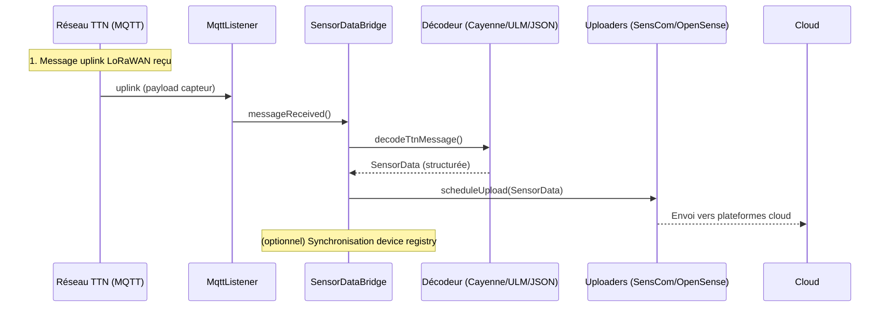
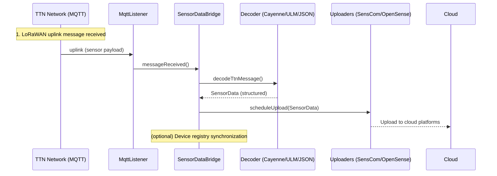

# Module : sensor-data-bridge (FR)

## Description (FR)
Ce module est le cœur de l’application. Il fait l’interface entre différents réseaux IoT (LoRa, TTN, Helium, NB-IoT), effectue le décodage des messages capteurs reçus, gère les interactions avec les plateformes Cloud (OpenSense, SensCom, etc.), expose des APIs REST d’intégration (Jersey) et communique des données via MQTT.

## Dépendances principales (FR)
- **Interne** : `cayenne` (décodage Cayenne LPP)
- **Logger** : SLF4J/reload4j
- **Cloud API** : Retrofit, Jersey
- **Format JSON/YAML** : Jackson core/dataformat
- **MQTT** : Eclipse Paho

## Instructions de build (FR)
```sh
mvn clean package
```
*Pour générer le JAR avec toutes les dépendances :*
```sh
mvn clean compile assembly:single
```

## Exécution (exemple) (FR)
```sh
java -jar target/sensor-data-bridge-*-jar-with-dependencies.jar [options]
```

## Génération de la Javadoc (FR)
```sh
mvn javadoc:javadoc
```
La documentation sera générée dans `target/site/apidocs/index.html`.

## Structure notable (FR)
- `nl.bertriksikken.loraforwarder` : point d’entrée (SensorDataBridge), config
- `nl.bertriksikken.ttn` : intégration The Things Network
- `nl.bertriksikken.pm`, `nl.bertriksikken.senscom`, `nl.bertriksikken.opensense` : décodage/protocoles Cloud

## Diagramme de séquence principal : flux uplink (FR)



## Tests (FR)
Lancez les tests (si disponibles) avec :
```sh
mvn test
```

---

# Module: sensor-data-bridge (EN)

## Description (EN)
This module is the core of the application. It interfaces with various IoT networks (LoRa, TTN, Helium, NB-IoT), decodes received sensor messages, manages integration with Cloud platforms (OpenSense, SensCom, etc.), exposes REST APIs (Jersey), and communicates data via MQTT.

## Main dependencies (EN)
- **Internal**: `cayenne` (Cayenne LPP decoder)
- **Logger**: SLF4J/reload4j
- **Cloud API**: Retrofit, Jersey
- **JSON/YAML format**: Jackson core/dataformat
- **MQTT**: Eclipse Paho

## Build instructions (EN)
```sh
mvn clean package
```
*To generate the JAR with all dependencies:*
```sh
mvn clean compile assembly:single
```

## Execution example (EN)
```sh
java -jar target/sensor-data-bridge-*-jar-with-dependencies.jar [options]
```

## Javadoc generation (EN)
```sh
mvn javadoc:javadoc
```
Documentation will be generated in `target/site/apidocs/index.html`.

## Notable structure (EN)
- `nl.bertriksikken.loraforwarder`: main entry point (SensorDataBridge), config
- `nl.bertriksikken.ttn`: The Things Network integration
- `nl.bertriksikken.pm`, `nl.bertriksikken.senscom`, `nl.bertriksikken.opensense`: cloud protocol/decoding

## Main sequence diagram: uplink flow (EN)



## Tests (EN)
Run tests (if available) with:
```sh
mvn test
```
